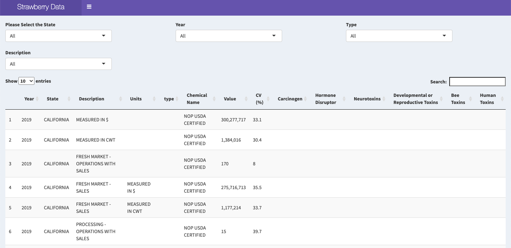

```{r setup, include=FALSE}
knitr::opts_chunk$set(echo = TRUE)
webshot::install_phantomjs()
library(tidyverse)
library(magrittr)
library(dplyr)
library(maps)
```

# Abstrct

After almost ten days of teamwork, we completed our assigned midterm project group.

The main work is as follows: organize and analyze the three data files, ask questions, visualize the data and solve the problems, draw conclusions, and finally summarize the completion of the project.

The order of layout of this article is data processing, data visualization,  pose questions and conclusions, summary, and references.

# Data Processing
We have three data files -- strawberries, insecticides, and herbicides-fungicides-other. The first two data files are used as data basis of our project, and the third one is the background information we need in the project.

## import original data

```{r,message=FALSE}
strawb <- read_csv("data/Strawberries.csv")
pesti <- read_csv("data/Pesticides.csv")
```

## data cleaning about strawb.csv
There may be missing data during data collection process. In this case, we delete the NA conditions to ensure the accuracy of subsequent operations. In addition, the first file -- strawberries also contains some unnecessary and repetitive information, which also needs to be precessed at this stage.

### drop all NA columns
```{r,message=FALSE}
drop_na_info <- function(df){
  cnames = colnames(df)
  T = NULL
  for(i in 1:ncol(df)){T <- c(T, nrow(unique(df[i])))}
  drop_cols <- cnames[which(T == 1)]
  return(dplyr::select(df, !all_of(drop_cols)))
}

strawb1 <- drop_na_info(strawb)

colnames(strawb1)
```
After droping NA columns, we get strawb1 with 10 columns.


### Separate ‘Data Item’ into 4 columns
Through the observation of the data, we found that 'Data Item' column covers a lot of data we need. There are four types of data in this column and make it messy and long, we need to separate this column into four columns.
```{r,message=FALSE}
strawb1 %<>% separate(col = 'Data Item', 
                      into = c("Strawberries", "Items", "Discription", "Units"),
                      sep = ",",fill = "right")

distinct(strawb1, Strawberries)

distinct(strawb1, Items)

distinct(strawb1, Discription)

distinct(strawb1, Units)
```
Separate ‘Data Item’ into "Strawberries", "Items", "Discription", "Units".


### Separate ‘Domain’ into 2 columns
The same as 'Data Item' column, 'Domain' column also contains two sets of data information. 
```{r,message=FALSE}
strawb1 %<>% separate(col = Domain, into = c("dname", "type"), sep = ",", fill = "right")

distinct(strawb1, dname)

distinct(strawb1, type)
```
Separate ‘Domain’ into "dname", "type".


### Separate 'Domain Category' into 2 columns
There are a lot of information in 'Domain Category' column that needs attention. Firstly, part of the information is repeated with previous column. Secondly, the information contains many unnecessary symbols such as "(",",",")".The main work of the following program is to isolate a small part of the information needed.
```{r, warning = FALSE,message=FALSE}
strawb1 %<>% 
  mutate(Chemicals = `Domain Category`) %>%
  relocate(Chemicals, .after = `Domain Category`)

strawb1 %<>% 
  separate(Chemicals, into =c('Title', 'Details'), sep = ":", fill = "right")

distinct(strawb1, Details)

strawb1$Details <- str_replace(strawb1$Details, "\\(", "")
strawb1$Details <- str_replace(strawb1$Details, "\\)", "")

strawb1 %<>% 
  separate(Details, into = c('Chemical Name', "Number"), sep = "=", fill = "right")

distinct(strawb1, `Chemical Name`)
distinct(strawb1, Number)

strawb1$`Chemical Name` <- str_trim(strawb1$`Chemical Name`)
```
Replicate 'Domain.Category' to new variable and separate this new variable into 'Title', 'Details'. 

And then clean 'Details' and separate it into 'Chemical Name', "Number". Also captalize all words in 'Chemical Name'.


### drop useless columns
After the data cleaning step, the data set looks clearly and we start to try data analysis in R. In the analysis, we found that some columns is not needed. So we dropped these useless columns in this step.
```{r,message=FALSE}
drops <- c("Strawberries", "Domain Category")
strawb1 <- strawb1[ , !(names(strawb1) %in% drops)]
```
Drop "Strawberries", "Domain Category", because it is useless in data analysis.


## data cleaning about pesti.csv
After processing the strawberries file, we begin to deal with pesti.csv. This file has less data, so the data cleaning required is relatively simple.

### drop NA rows in pesti.csv and clean it
```{r,message=FALSE}
pesti1 <- pesti %>% rename('Chemical Name' = Pesticide )

pesti1 %<>% filter(!is.na(pesti1))

pesti1$`Chemical Name` <- toupper(pesti1$`Chemical Name`)
```
Drop NA rows in pesti.csv, finally we get pesti1 with 45 rows.

And then rename 'Pesticide' to 'Chemical Name' and captalize all words in 'Chemical Name'.


### Define Human Toxins level
Based on the existing information, we hope to construct a variable to represent human toxin levels.
```{r,message=FALSE}
pesti1 <- pesti1 %>% mutate('Human Toxins' = case_when(
  pesti1$Carcinogen == "known" | pesti1$Neurotoxins== "present" | pesti1$`Developmental or Reproductive Toxins`== "present" ~ "high" ,
  pesti1$Carcinogen == "possible" & pesti1$`Hormone Disruptor`=="suspected" & is.na(pesti1$Neurotoxins) & is.na(pesti1$`Developmental or Reproductive Toxins`)~ "moderate",
  pesti1$Carcinogen == "possible" & is.na(pesti1$`Hormone Disruptor`) & is.na(pesti1$Neurotoxins) & is.na(pesti1$`Developmental or Reproductive Toxins`)~ "slight",
  pesti1$Carcinogen == "probable" & is.na(pesti1$`Hormone Disruptor`) & is.na(pesti1$Neurotoxins) & is.na(pesti1$`Developmental or Reproductive Toxins`)~ "slight",
  is.na(pesti1$Carcinogen) & pesti1$`Hormone Disruptor`=="suspected" & is.na(pesti1$Neurotoxins) & is.na(pesti1$`Developmental or Reproductive Toxins`)~"slight"
))
```
Use columns 'carcinogen', 'Neurotoxins', 'Developmental or Reproductive Toxins' to define human toxins level.

High toxic for human: carcinogen = known or Neurotoxins = present or `Developmental or Reproductive Toxins` = present.

Moderate toxic for human: carcinogen = probable/possible and `Hormone Disruptor` = suspect.

Slight toxic for human: carcinogen= possible/possible or `Hormone Disruptor` = suspect, only one happens.


## wrangling two datasets
These two data sets use the same chemical name column(pesticide name) as the join key.

```{r,message=FALSE}
strawbPesti <- inner_join(strawb1, pesti1,by="Chemical Name")

# Write the dataset into csv.
write_csv(strawbPesti, "strawbPesti.csv")
```
Combine two dataset into strawbPesti.csv by key column 'Chemical Name'. Only keep rows with known pesticides.


# Construct maps 

## Map of states in USA 
There are only four states used in data sets, which are shown in colors on the map of the United States.
```{r,warning=FALSE}
usamap<-function(){
  usa_map <- map_data("state")
  states<-c("California","Florida","Oregon","Washington")
  region<-tolower(states)
  tmp<-data.frame(cbind(states,region))
  gg <- ggplot()
  gg <- gg + geom_map(data=usa_map, map=usa_map,
                    aes(long, lat, map_id=region),
                    color="black", size=0.15, fill=NA)
  gg <- gg + geom_map(data=tmp, map=usa_map,
                    aes(fill=states, map_id=region),
                    color="black", size=0.15)
  gg
}
usamap()
```

## Map of selected states
Take California as an example, we use a custom function to display a map of California.
```{r,warning=FALSE}
map<-function(statename){
  m<-map_data("county",statename)
  
  p<-ggplot(data=m,
            mapping=aes(x=long,y=lat,group=group,fill=region))
  p+geom_polygon()+guides(fill=FALSE)+ggtitle(statename)
  
}
map("California")
```


# Pose Questions and Conclusions

## What pesticides do each state use and how toxic are they?

This issue is what our team members intend to start studying. Because the main content of the pesticide file is the toxins of pesticides, we began to study the degree of toxins to humans.

## Preparation for data visualization
```{r,message=FALSE}
pacman::p_load('ggplot2', 'plotly',"dplyr")
```

### clean strawbPesti.csv
```{r,message=FALSE}
distinct(strawbPesti,State)
strawbPesti <- arrange(strawbPesti,`Chemical Name`)
#colnames(strawbPesti)
strawbPesti1 <- strawbPesti[,-13]
strawbPesti2 <- strawbPesti1[,c(2,4,7,12,13,20)]
strawbPesti3 <- filter(strawbPesti2, Discription==" MEASURED IN LB")
strawbPesti4 <- filter(strawbPesti3, Value !="(D)")
strawbPesti4$Value <- as.numeric(sub(",", "", strawbPesti4$Value, fixed = TRUE))

strawbPestiAVG <- strawbPesti4 %>%
  group_by(State, `Chemical Name`,`Human Toxins`) %>%
  summarise(Value,Value=mean(Value))
```
Only choose columns we will use: 'Year', 'State', 'Discription', 'Chemical Name', 'Value', 'Human Toxins'. Which is dataset "strawbPesti2".

We can see from strawbPesti2, values are different depend on measured methods for each chemical type in each state, so we can choose one method to go deep, finally we chose "MEASURED IN LB". Then we get dataset "strawbPesti3".

Then we drop no meaning rows of value. And change value into numeric variable. Finally we get dataset "strawbPesti4".

To compare pesticides' toxin level, we can take average value across 2016-1019. We build dataset "strawbPestiAVG".

## How Toxic are the chemicals on strawberries for humans and bees?

Then let’s look at more specific issues.
According to the colors shown in the pictures, the hazards of various chemicals can be seen. 

```{r}
Plot <- ggplot(strawbPesti) + geom_point(aes (x= State, y= `Chemical Name`, color= `Human Toxins`)) + labs(title= 'How Toxic are the chemicals on strawberries for humans?') + scale_color_manual(values = c("high" = "#D55E00", "moderate"="#E69F00", "slight"="#009E73")) 
#colors used are from the color blind palette
Plot
#add a note about how we determined human toxins
```

```{r}
Plot1 <- ggplot(strawbPesti) + geom_point(aes (x= State, y= `Chemical Name`, color= `Bee Toxins`)) + labs(title= 'How Toxic are the chemicals on strawberries for bees?') + scale_color_manual(values = c("high" = "#D55E00", "moderate"="#E69F00", "slight"="#009E73"))
Plot1
```

## show all states chemical usage value
From the following plot, we can see California and Florida have relatively more points, that means California and Florida used relatively more kinds of pesticides in 2016-2019, and we can also see the values of these pesticides from this plot. At the same time, Washington state used only two kinds of pesticides through 2016-2019. 

It also can be seen from the figure is that the pesticides are harmful to humans are only used in California and Florida.

```{r,message=FALSE}
ggplot(strawbPestiAVG) + 
  geom_point(aes( x= `Chemical Name`, y= Value,col=`Human Toxins`)) + 
  facet_grid(`Human Toxins`~State) 

```


## Chemical usage in different states 

To see the details of pesticides usage in specific state, we set a function to show different State's pesticides usage and how toxin they are. 
```{r,message=FALSE}
## choose input by yourself
pestiToxin <- function(state1){
  data <- filter(strawbPestiAVG,State==state1)
  bar <- ggplot(data)+
  geom_bar(mapping = aes(x=`Chemical Name`,y=Value,fill=`Human Toxins`), position = "dodge",stat = "identity")+
  scale_fill_manual(values = c("high" = "#D55E00", "moderate"="#E69F00", "slight"="#009E73"))+
    labs(title = state1)+
    theme(axis.text.x = element_text(angle = 90, vjust = 0.5, hjust=1))
  bar2 <- ggplot(data)+
  geom_bar(mapping = aes(x=`Chemical Name`,y=Value,fill=`Human Toxins`), position = "dodge",stat = "identity")+
  scale_fill_manual(values = c("high" = "#D55E00", "moderate"="#E69F00", "slight"="#009E73"))+
    labs(title = state1)
  list(bar, bar2+coord_polar())
}

pestiToxin("CALIFORNIA")
pestiToxin("FLORIDA")
pestiToxin("WASHINGTON")
```


# Summary

## Shiny 
Shiny is an R package that makes it easy to build interactive web apps straight from R.

In the shiny we made, click the button in the upper left corner to switch to view the data table, data icon, and map. In the data table, you can select the required data according to the state, year, and type. This interactive shiny file provides visual data content. Bring a more convenient and in-depth experience to those who view the data.

```{r,  out.width="100%", fig.cap="A shiny App."}

```
\newpage

## Pros and Cons

Because we completed this project in a short time, we learned a lot of knowledge from the team members, and there are also some areas for improvement.

### What we learn?

We are more familiar with R's data processing program, and apply the knowledge in class to practical problems. At the same time, data visualization is also our main focus this time. The data is reflected in tables, charts, maps and other aspects.

The realization of shiny files is another brand new attempt. The use of shiny files can realize interactive data visualization.

At the same time, the experience of group members working together to complete mid-term assignments also allows us to learn from the group members and get the experience of cooperation.

### What needs to be improved?

In terms of time allocation, we still need better arrangements. Our program is relatively tight to complete this time. Because the time was not planned well at the beginning of the task, the work piled up before due time.

In terms of data processing, we have omitted a lot of NA data. If we can find a better way to fill in the blank data than directly delete it, we can further optimize it.

In terms of raising and solving the problem this time, the problem we raised is relatively simple, and the conclusion is also based on data visualization, and there is no specific comparison data. At this point, we can also optimize.

# Reference

1.Mastering Shiny  https://mastering-shiny.org/

2.R for Data Science https://r4ds.had.co.nz/index.html

3.Exploratory Data Analysis in R https://blog.datascienceheroes.com/exploratory-data-analysis-in-r-intro/

